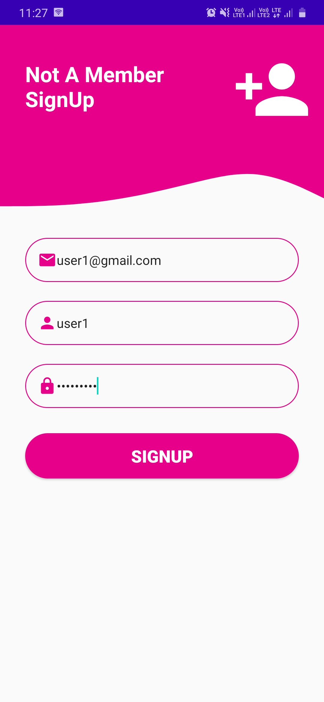
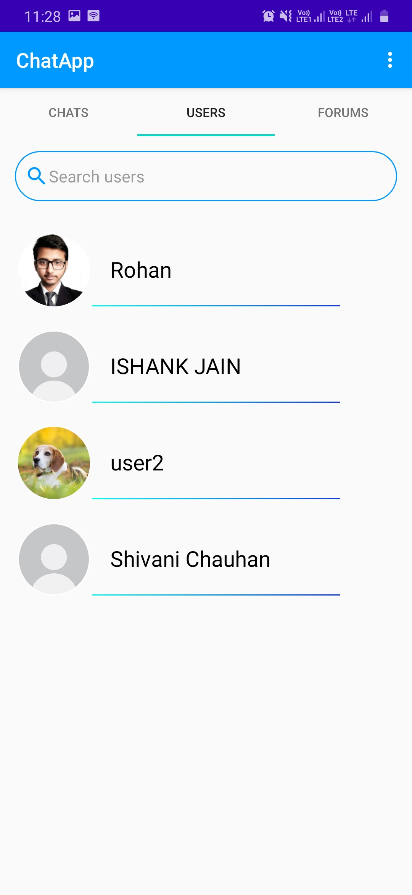
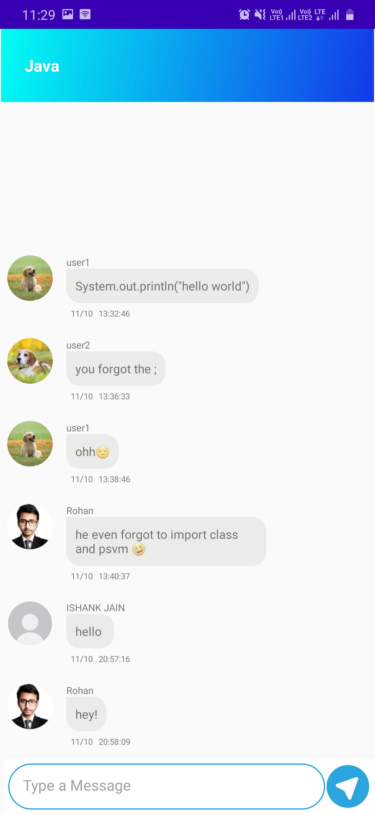
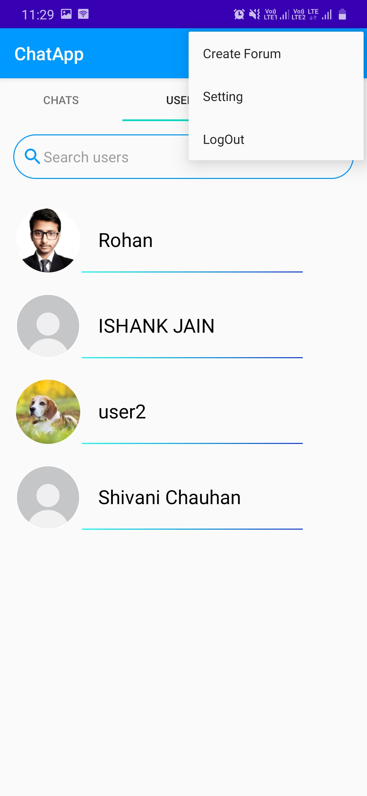

# Firebase-ChatApp
A chatting application built with the help of firebase and Android Studio.

## Features
* Register and Login with email address by Using Firebase Auth
* One to One and Forum chat by Using Firebase Realtime Database
* Uploading Profile Pic by using Glide and Firebase Storage
* Search different users and Create New Forums For Discussion
* LogOut to use multiple Accounts

## Screenshots

     
     
     

     
     
     

     
     
    

